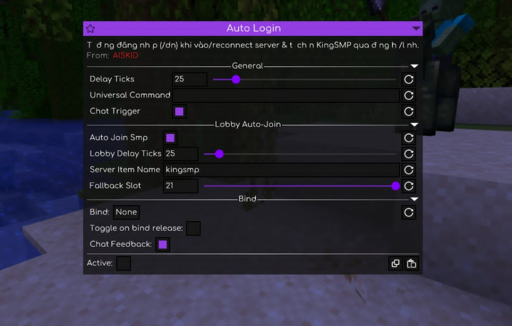

# AISKID Meteor Addon

A custom Meteor Client addon built for automated tasks, including Auto Login with lobby auto-join and an automated Blaze Rod trade loop module.

> **Note:** **FULLY AI GEN CODE**

---

## Features (What Can It Do?)

### 1. AutoLogin
- Automatically logs in via `/dn` or custom commands upon connecting/reconnecting to the server.
- Supports chat-triggered login detection.
- Includes **Lobby Auto-Join**: automatically detects server selector items (like clocks or custom items) to enter KingSMP or fallback slots.

### 2. BlazeLoop
- Automated closed-loop buying & delivery system for Blaze Rods.
- **Workflow**: Mua Blaze Rod từ shop (`/shop` -> Nether -> Que lửa) -> Tự động mở đơn hàng -> Trả đơn/Giao hàng -> Lặp lại quy trình với fast polling.
- Handles stack splitting, item delivery confirmation, order reloading, and blacklist filtering.

---

## How to Build

Requirements:
- JDK 21+
- Git

Run the Gradle build command:

**Windows:**
```powershell
.\gradlew.bat build
```

**Linux / macOS:**
```bash
./gradlew build
```

The compiled `.jar` file will be located in `build/libs/`.

---

## How to Use

1. Build the `.jar` file or download the latest release build.
2. Put the generated `.jar` file into your `.minecraft/mods` folder along with **Meteor Client** and **Fabric Loader**.
3. Launch Minecraft and open the Meteor Client ClickGUI (default key: `RSHIFT`).
4. Find the **AISKID** category and configure your modules.

---

## Configuration Guide

### Configuring AutoLogin


Most settings can be kept at their **default** values. You only need to set your login command:
- **Universal Command:** `/dn {matkhautaikhoancuamay}` *(Replace `{matkhautaikhoancuamay}` with your actual password)*
- **Delay Ticks:** Default (`25`)
- **Chat Trigger:** Enabled
- **Auto Join Smp:** Enabled (if you want automatic KingSMP lobby joining)

### Configuring BlazeLoop
- **Min Price (`min-price`):** Recommendation: set the price **`>= 151`** (higher than or equal to 151) for optimal trade profit/margins.
- Other timeouts, delays, and slot fallbacks can remain at their defaults or tuned according to server latency.

---

## Credits & Acknowledgements

- Special thanks to **HerlysAddon** for the free code and baseline implementation!
- **HerlysAddon Discord:** [https://discord.gg/aTTg6QFJPN](https://discord.gg/aTTg6QFJPN)
